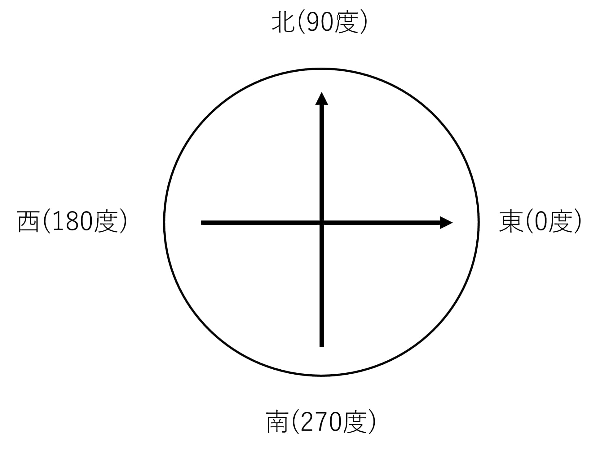

module

- **class_yolo.py**
  - NSE2023のclass_yolo.pyをYOLOX用に書き直したもの
  - NSE2023のclass_yolo.pyと同じ使い方で使えるようにしたつもり, ARLISSの新ゴールで動かすときは`old_goal_or_new_goal="new_goal"`とする必要がある
  - 学習に使用したデータセットはSTEPのGoogle Drive
  - https://drive.google.com/file/d/1Ynkgd8pMZKVOczLOVe_O8zRqQcuTPGyY/view?usp=drive_link
  - にあります

- **class_mag3.py**
  - 地磁気センサー用のプログラム
  - thetaの値について東が0度、北が90度、西が180度、南が270度になるようにmax_x, max_yの値を入れ替えたり-1倍にしたりしてください
  - 
